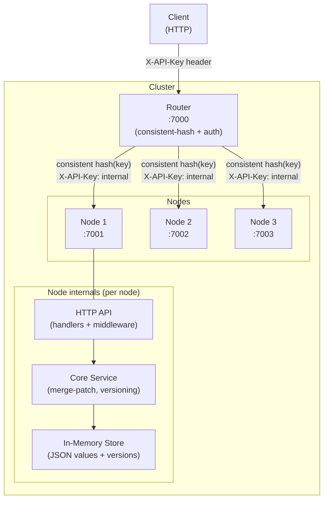

# Mimir

[](https://github.com/ksysoev/mimir/actions/workflows/tests.yml)
[](https://codecov.io/gh/ksysoev/mimir)
[](https://pkg.go.dev/github.com/ksysoev/mimir)
[](https://opensource.org/licenses/MIT)

In-memory key-value store for JSON data with versioning and optimistic locking. Can be run as a single node or as a sharded cluster behind a built-in router.

---

## Architecture



**Key design points:**
- The **Router** hashes each key to a deterministic node — the same key always lands on the same node.
- **Nodes** are internal-only; only the router port is exposed publicly.
- Auth uses a **client-facing key** (Router ↔ Client) and a separate **internal key** (Router ↔ Nodes).
- Every write increments a monotonic **version counter**; conditional writes use `?ifVersion=<n>`.

---

## Running locally

### Option A — Single node (Docker)

```sh
docker compose up --build
# API available at http://localhost:7000
# Default API key: changeme
```

### Option B — 3-node cluster (Docker)

```sh
docker compose -f docker-compose.cluster.yml up --build
# Router available at http://localhost:7000
# Default API key: changeme
```

### Option C — Binary from source

```sh
# Build
CGO_ENABLED=0 go build -o mimir -ldflags "-X main.version=dev -X main.name=mimir" ./cmd/mimir/main.go

# Run as single node
./mimir node --config runtime/config.yml

# Run router (expects nodes already running)
./mimir router --config runtime/router.yml
```

#### `runtime/config.yml` — node config
```yaml
api:
  listen: ":7000"
  key: "changeme"
```

#### `runtime/router.yml` — router config
```yaml
router:
  listen: ":7000"
  key: "changeme"
  internal_key: "internal-secret"
  nodes:
    - id: "node-1"
      url: "http://localhost:7001"
    - id: "node-2"
      url: "http://localhost:7002"
    - id: "node-3"
      url: "http://localhost:7003"
```

### Option D — Install via Go

```sh
go install github.com/ksysoev/mimir/cmd/mimir@latest
mimir node --config runtime/config.yml
```

---

## API

Authentication: pass your API key in the `X-API-Key` header on every request.

All values are JSON. `Content-Type: application/json` is required on `PUT` and `PATCH`.

| Method | Path | Description |
|--------|------|-------------|
| `GET` | `/livez` | Health check (no auth required) |
| `GET` | `/kv` | List all keys (NDJSON stream) |
| `GET` | `/kv/{key}` | Retrieve a JSON value |
| `PUT` | `/kv/{key}` | Store / overwrite a JSON value |
| `PATCH` | `/kv/{key}` | JSON merge-patch (partial update) |

**Common response headers**

| Header | Description |
|--------|-------------|
| `X-Key` | Key that was read/written |
| `X-Version` | Current version after the operation |

**Conditional writes** — append `?ifVersion=<n>` to `PUT` or `PATCH`. Returns `409 Conflict` on mismatch.

---

## Production examples — `mimir.make-it-public.dev`

Replace `YOUR_API_KEY` with your actual key in all examples below.

```sh
export MIMIR_HOST="https://mimir.make-it-public.dev"
export MIMIR_KEY="YOUR_API_KEY"
```

### Health check
```sh
curl "$MIMIR_HOST/livez"
# 200 OK
```

### Store a value
```sh
curl -X PUT "$MIMIR_HOST/kv/config" \
  -H "X-API-Key: $MIMIR_KEY" \
  -H "Content-Type: application/json" \
  -d '{"timeout":30,"retries":3}'
# X-Version: 1
```

### Retrieve a value
```sh
curl -s "$MIMIR_HOST/kv/config" \
  -H "X-API-Key: $MIMIR_KEY" | jq .
# {"timeout":30,"retries":3}
```

### Inspect metadata without fetching the body
```sh
curl -sI "$MIMIR_HOST/kv/config" \
  -H "X-API-Key: $MIMIR_KEY"
# X-Key: config
# X-Version: 1
```

### Partial update (merge-patch)
```sh
# Only change `timeout`; retries stays intact
curl -X PATCH "$MIMIR_HOST/kv/config" \
  -H "X-API-Key: $MIMIR_KEY" \
  -H "Content-Type: application/json" \
  -d '{"timeout":60}'

curl -s "$MIMIR_HOST/kv/config" -H "X-API-Key: $MIMIR_KEY" | jq .
# {"timeout":60,"retries":3}
```

### Conditional (optimistic-lock) update
```sh
# Succeeds only if current version is 2
curl -X PUT "$MIMIR_HOST/kv/config?ifVersion=2" \
  -H "X-API-Key: $MIMIR_KEY" \
  -H "Content-Type: application/json" \
  -d '{"timeout":90,"retries":5}'
# 409 Conflict if version != 2
```

### List all keys
```sh
curl -s "$MIMIR_HOST/kv" \
  -H "X-API-Key: $MIMIR_KEY"
# {"key":"config","node":"node-1"}
# {"key":"greeting","node":"node-2"}
```

---

## Roadmap

See [ROADMAP.md](ROADMAP.md) for upcoming features: DELETE, TTL expiry, cache headers, eviction policies, OpenTelemetry, SSE watch, namespaces, and replication.

---

## License

MIT — see [LICENSE](LICENSE).
