# Mimir — Technical Roadmap

This document captures high-level design plans for future work on Mimir.
Each item includes a short motivation, a component diagram, expected benefits, key tradeoffs, and a rough effort/sequence.
Items are ordered by recommended delivery sequence, not by importance alone.

---

## Table of Contents

1. [DELETE Operation](#1-delete-operation)
2. [TTL & Eviction Policy](#2-ttl--eviction-policy)
3. [Fork-Based Consistent Snapshot](#3-fork-based-consistent-snapshot)
4. [Observability — Prometheus Metrics](#4-observability--prometheus-metrics)
5. [Key-Change Notifications (Watch / SSE)](#5-key-change-notifications-watch--sse)
6. [Namespace & Prefix Isolation](#6-namespace--prefix-isolation)
7. [Replication (Primary → Replica)](#7-replication-primary--replica)
8. [LSM-Tree Persistence Backend](#8-lsm-tree-persistence-backend)

---

## System Overview

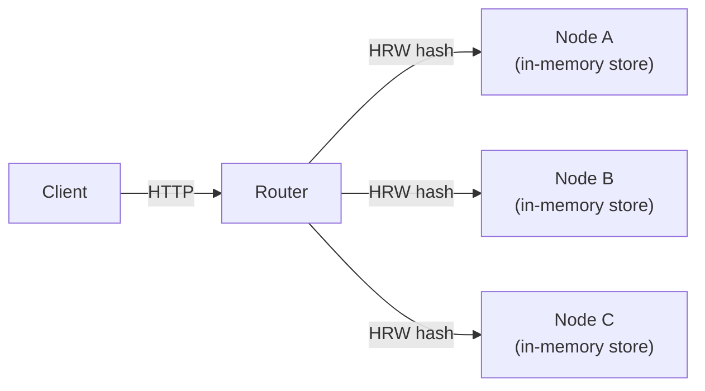

The router uses **Highest-Random-Weight (HRW / Rendezvous) hashing** to deterministically map each key to one node. Adding or removing a node remaps only ~1/N keys. All items below are purely additive — the clean `kvStore` interface (`Get`, `Put`, `ListKeys`) is the primary extension seam.

---

## 1. DELETE Operation

### Motivation

`DELETE /kv/{key}` is conspicuously absent and is a hard dependency for several items below (TTL eviction, snapshot compaction, namespace cleanup). It is the smallest change on the roadmap and should ship first.

### Design

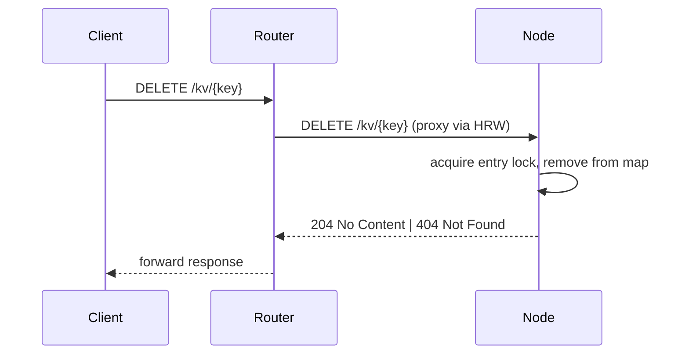

**Changes:**
- Extend `kvStore` interface with `Delete(ctx, key) error`
- Implement in `inmemory.Store` — delete the map entry under the write lock
- Add handler in `pkg/api/handlers.go`
- Register `DELETE /kv/{key}` in both `pkg/api/api.go` and `pkg/router/router.go`

### Benefits
- Enables key lifecycle management
- Unblocks TTL eviction, snapshot compaction, and namespace cleanup

### Tradeoffs
- Version counter resets to zero on re-creation — clients relying on monotonic version guarantees across delete/recreate must be aware
- Router has no tombstone awareness; a deleted key returns 404 immediately with no grace period

### Effort
| Task | Size |
|------|------|
| Interface + inmemory impl | XS |
| API handler + routing | XS |
| Router proxy registration | XS |
| Tests | S |

**Total: ~1–2 days**

---

## 2. TTL & Eviction Policy

### Motivation

In-memory stores without bounded key lifetimes accumulate stale data until the process is restarted. TTL allows cache and session use-cases and gives operators a mechanism to control memory growth without manual `DELETE` calls.

### Design

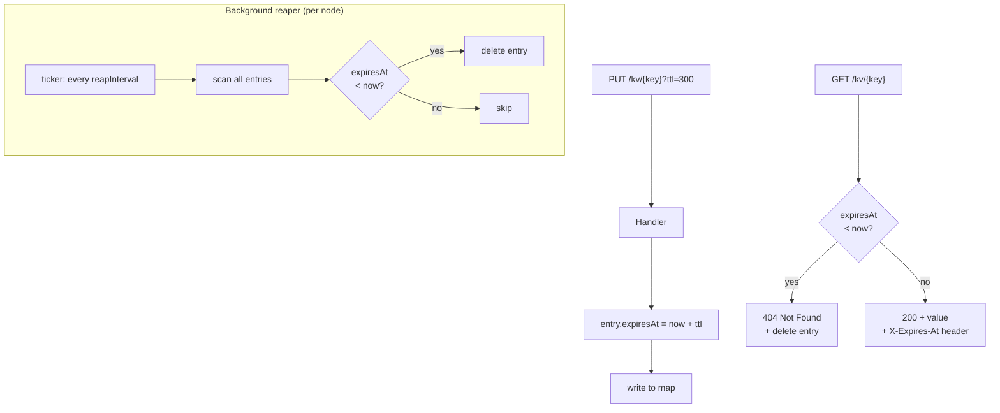

**Eviction strategies (both applied together):**

| Strategy | Latency impact | Purpose |
|----------|---------------|---------|
| Lazy (on `Get`) | none at idle | Immediate 404 on access; frees entry lock |
| Active ticker | background GC | Reclaims memory for write-only / unread keys |

**Changes:**
- Add `expiresAt time.Time` to `inmemory.entry` (zero = no expiry)
- Extend `core.Item` with `TTL time.Duration`
- Parse `?ttl=<seconds>` in PUT/PATCH handlers; set `X-Expires-At` on GET
- Add reaper goroutine started in `NewStore`; interval configurable via `Config`

### Benefits
- Cache and session semantics without client-side cleanup
- Bounded memory under write-heavy workloads
- Zero interface change to `kvStore` — TTL is a store-internal concern

### Tradeoffs
- Clock skew across nodes means TTL semantics differ slightly per shard — acceptable for cache use-cases, not for strong consistency guarantees
- Active reaper adds GC pressure on large key sets; tune `reapInterval` per workload
- Router `listKeys` fan-out may briefly return keys that have expired on their node but whose reaper hasn't run yet

### Effort
| Task | Size |
|------|------|
| `entry.expiresAt` + lazy eviction | S |
| Active reaper goroutine | S |
| Config wiring | XS |
| Handler query-param parsing + headers | S |
| Tests (unit + integration) | M |

**Total: ~1 week**

---

## 3. Fork-Based Consistent Snapshot

### Motivation

Mimir is entirely in-memory: a process crash loses all data. Fork-based snapshots provide crash recovery without introducing a persistent storage layer, keeping the system's simple character intact. A Unix `fork()` gives the child a copy-on-write frozen view of the parent's memory at the instant of the fork — the parent continues serving traffic with no stop-the-world pause.

### Design

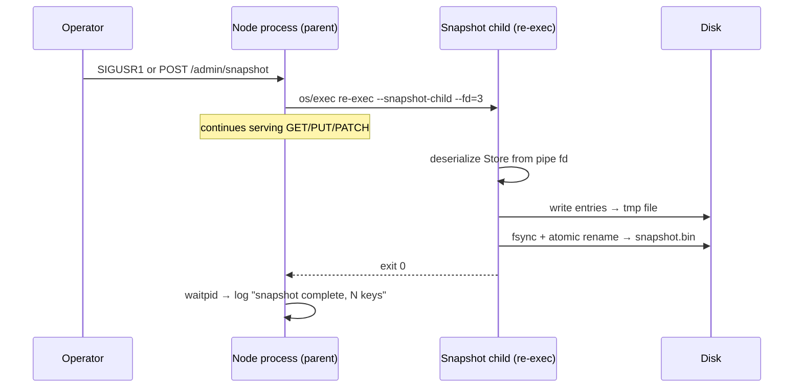

**Why re-exec instead of raw `fork()`?**
Go's runtime manages goroutines, mutexes, and file descriptors across the process. A raw `fork()` leaves the child with a broken runtime state (other goroutines mid-lock, GC state inconsistent). The safe Go pattern is to re-exec the same binary with a hidden flag (`--snapshot-child`), pass the serialized store state over a pipe opened before exec, and let the child write only to disk.

**Snapshot file layout:**

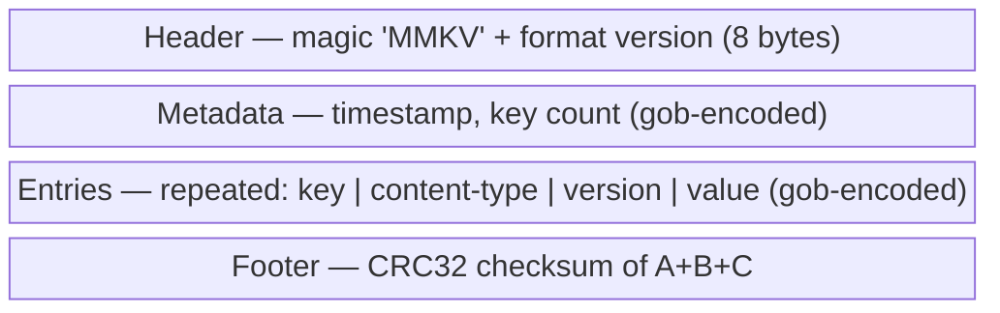

**Restore on startup:**

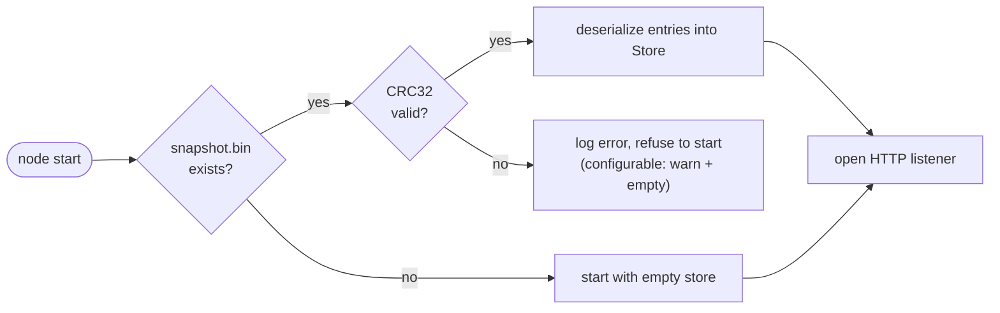

**New package layout:**
```
pkg/
  snapshot/
    snapshot.go       ← Snapshot(store), Restore(store) public API
    format.go         ← encode / decode + CRC32
    child_unix.go     ← re-exec child entrypoint  (build tag: !windows)
    child_stub.go     ← brief read-lock fallback   (build tag: windows)
pkg/cmd/
  node.go             ← wire SIGUSR1 + startup Restore
pkg/api/
  handlers.go         ← POST /admin/snapshot endpoint
```

### Benefits

| Benefit | Detail |
|---------|--------|
| Zero client-visible pause | COW page sharing; parent never stops |
| Crash recovery | Restore from last snapshot; data-loss window = time since last snapshot |
| Cheap to schedule | Snapshot every 60 s with negligible overhead on read-heavy nodes |
| Simple artifact | Single file; easy to copy to S3 / GCS via a sidecar |

### Tradeoffs

| Risk | Mitigation |
|------|-----------|
| COW memory spike on write-heavy nodes during snapshot | Monitor RSS delta; add `max_snapshot_memory_mb` safeguard |
| Not a WAL — last N seconds of writes are lost on crash | Document RPO; pair with replication (item 7) for stronger durability |
| `fork` is Linux/macOS only | `child_stub.go` build tag falls back to a brief read-lock + serialize on Windows |
| Re-exec requires the binary to be accessible at runtime | Standard for containerized deployments; document path requirement |
| Corrupt snapshot file | CRC32 footer verified on restore; configurable fail-fast vs warn-and-continue |

### Effort
| Task | Size |
|------|------|
| `snapshot/format.go` — encode/decode + CRC, unit-tested | S |
| `child_unix.go` — re-exec self, pipe, write file | M |
| Restore on startup | S |
| SIGUSR1 handler + `POST /admin/snapshot` | S |
| Integration test (snapshot → restart → verify) | M |

**Total: ~3–4 weeks (production quality) / ~1 week (prototype)**

---

## 4. Observability — Prometheus Metrics

### Motivation

Before adding more complexity (replication, persistence), operators need visibility into the system's runtime behaviour. A `/metrics` endpoint is low effort and high payoff.

### Design

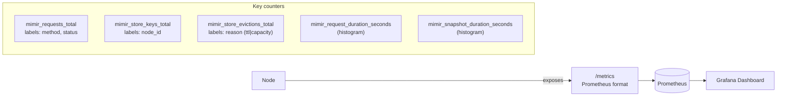

**Changes:** add `prometheus/client_golang`; wrap `inmemory.Store` methods with metric increments; register `GET /metrics` handler (no auth or internal-key auth only).

### Effort: ~2–3 days

---

## 5. Key-Change Notifications (Watch / SSE)

### Motivation

Clients currently poll for changes. Server-Sent Events on `GET /kv/{key}/watch` allow cache-invalidation and reactive patterns without polling overhead or a protocol change.

### Design

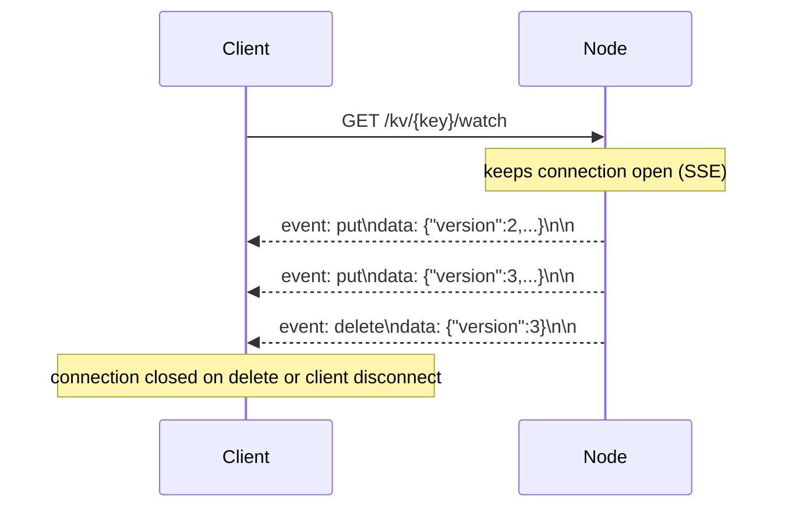

**Changes:**
- Add a per-key `broadcast` channel (or `sync.Map` of subscriber channels) in `inmemory.Store`
- `Put`/`Delete` fan-out events to all subscribers after the write commits
- HTTP handler writes `Content-Type: text/event-stream` and blocks until key deleted or client disconnects
- Router proxies watch requests to the owning node (same HRW routing)

### Tradeoffs
- Each open watch holds a goroutine + channel; needs a max-watchers-per-key limit
- Router must not buffer SSE stream — ensure `http.Flusher` is used end-to-end

### Effort: ~1.5 weeks

---

## 6. Namespace & Prefix Isolation

### Motivation

Multi-tenant use-cases need key isolation, independent capacity limits, and per-namespace auth tokens — without running separate node clusters.

### Design

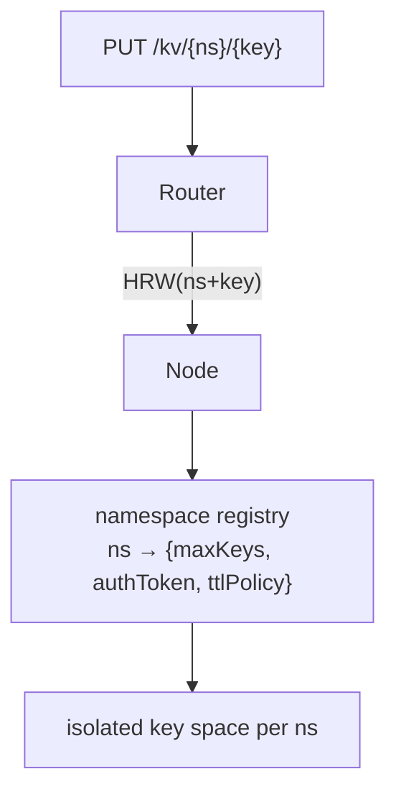

**API change:** path prefix `/kv/{ns}/{key}` (backwards-compatible — existing `/kv/{key}` becomes the `default` namespace).

**Changes:**
- Router config gains `namespaces` section
- `inmemory.Store` shards its map by namespace prefix; limits enforced per namespace
- `Config` gains per-namespace `MaxKeys`, `DefaultTTL`, `AuthToken`

### Effort: ~2 weeks

---

## 7. Replication (Primary → Replica)

### Motivation

HRW sharding distributes keys but provides no redundancy. A single node failure loses its entire key shard. Async replication to one standby replica per shard makes each shard fault-tolerant.

### Design

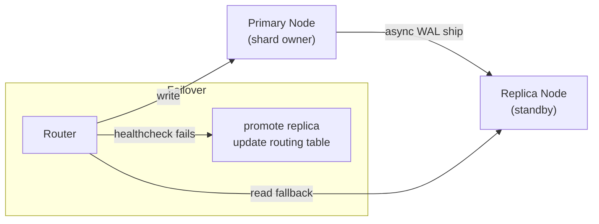

**Changes:**
- Each node gains a replication log (append-only in-memory queue, flushed to replica via gRPC stream)
- Router config maps each primary to an optional `replica_url`
- Router falls back to replica on primary health-check failure; promotes it for writes

### Tradeoffs
- Async replication means replica may lag by one or more writes — RPO > 0
- Promotion logic must prevent split-brain (fencing token or epoch check)

### Effort: ~4–6 weeks

---

## 8. LSM-Tree Persistence Backend

### Motivation

If replication alone is insufficient (e.g., simultaneous primary + replica crash), a durable on-disk backend is the final backstop. An LSM-tree engine provides fast sequential writes and compaction-based garbage collection.

### Design

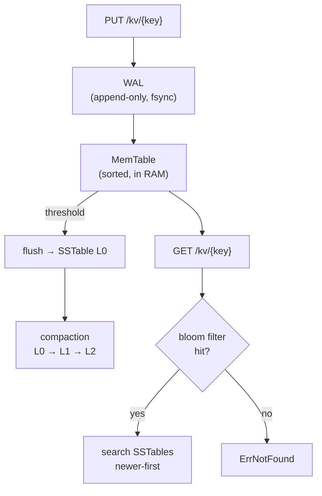

**Recommendation:** implement via the existing `kvStore` interface backed by `cockroachdb/pebble` or `dgraph-io/badger/v4` rather than building LSM internals from scratch. The interface seam makes the swap transparent to the rest of the system.

### Tradeoffs
- Read amplification: worst case touches all levels (mitigated by bloom filters + block cache)
- Write amplification: compaction rewrites data multiple times — tune `L0_compaction_trigger`
- Adds a CGo-free but non-trivial dependency; increases binary size ~10 MB

### Effort: ~1 week (pebble/badger integration) / 6–8 weeks (build from scratch)

---

## Priority Matrix


## Recommended Delivery Sequence

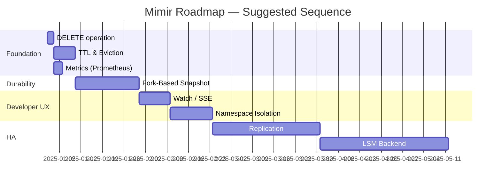
